# AI Import tool CSV to SQL Schema mapping

## Pre-requisites

- You need an [IBM Cloud Account](https://cloud.ibm.com/). 
- Access to the [IBM watsonx.ai Lite version](../watsonx-getting-started.md)

## Part 1. Access IBM watsonx Prompt Lab

Go to  IBM Cloud Console list of resources https://cloud.ibm.com/resources

In the **AI/Machine Learning** category click on your Watson Studio service

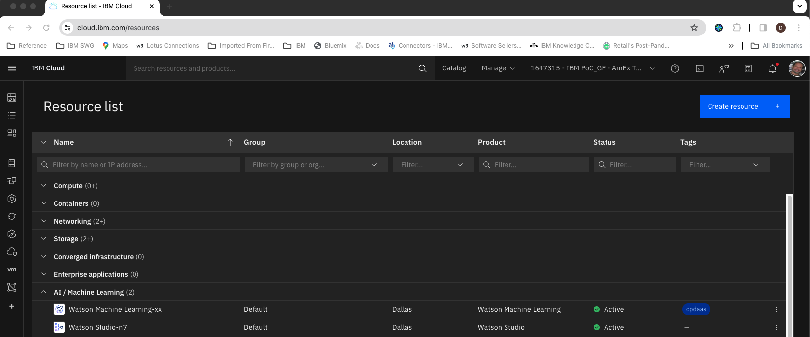
 
From the  **Launch in** drop down select **IBM watsonx**

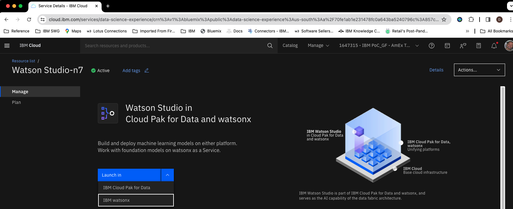

Close the dialog that asks you to take a tour.

Click on the tile called **Experiment with foundation models and build prompts**

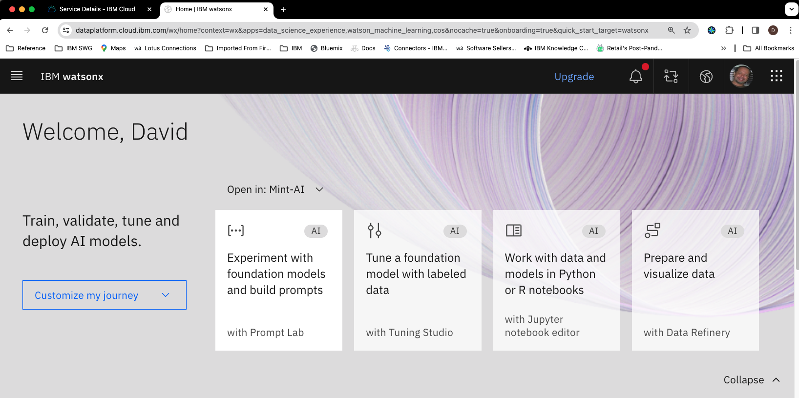


## Part 2. One shot prompt for CSV to SQL mapping generation

From the model selection drop down select **View all foundation models**

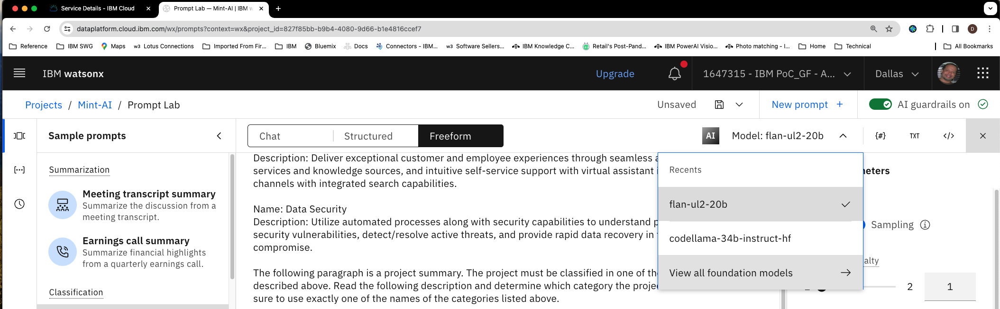

Select the *codellama-34b-instruct-hf* model and click on **Select model**

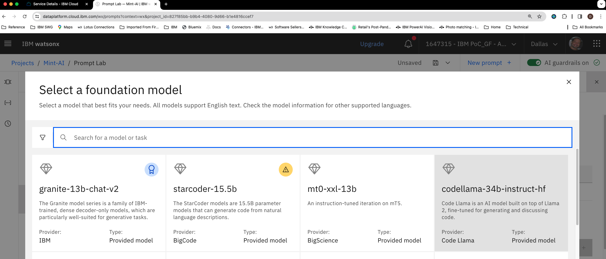

Click on **New prompt +** (above the model selection drop down ). Click on **Don't save** when prompted.

Make sure the *Structured* tab is selected (instead of *Freeform* or *Chat*)

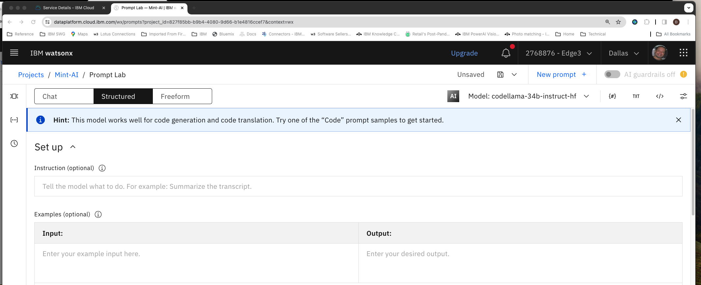

Copy the  following into the **Instruction (optional)** cell 
```
Given the follow db schema and csv file sample create a mapping between each csv field and a column in the database. if no database column matches a csv field, add that field to an array called "unmapped". Generate only the mapping do not add any explanations.
```
Copy the following into the **Input:** cell just below *Examples (optional)*
```
csv_sample:
state,mailing_address,city,zip,favorite_pastimes,age,weight
NY,1003 Main St,Albany,10909,fishing,34,80kg

client schema:
home_address [ TEXT ]
postal_code [ TEXT ]
province [ TEXT ]
hobbies [TEXT]
```
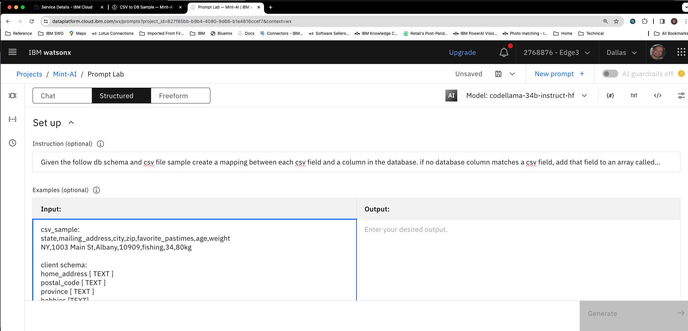

Copy the following the **Output:** cell. This is the expected output for the example.

```
{"mapped":[{"state": "province"},
{"mailing_address": "home_address"},
{"zip": "postal_code"},
{"favorite_pastimes":"hobbies"}],
"unmapped": ["age","weight"]}
```
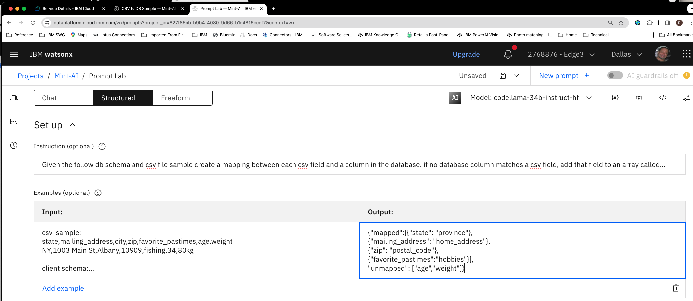

Next copy the following into the **Input:** cell right below the label *Test your prompt*. This is the actual prompt.
```
csv_sample:
customer_id,total_purchases,gender,last_name,first_name,phone_number
1001,7896.78,F,Doe,Jane,888-789-0909

client schema:
client_id [ INT ] primary_key
surname [ TEXT ] 
given_name [ TEXT ] 
invoice_total [ DECIMAL ]
sex [ TEXT ]

json:
```
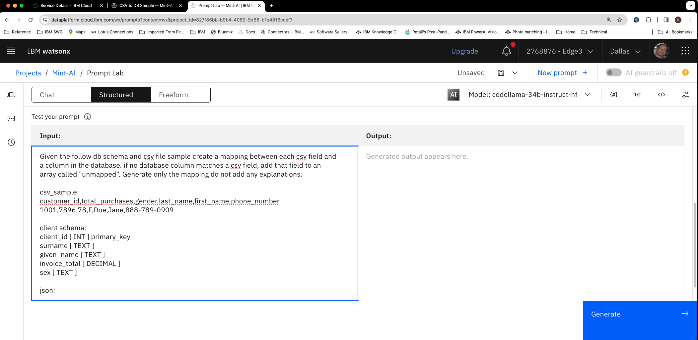

Next click on **Model parameters**(top right) and change the *Decoding* to **Sampling**

Under *Stop sequences* enter `]}` followed by the return key and then press the **+** icon to add the sequence. This will ensure that the LLM will stop generating 
after the JSON is generated.

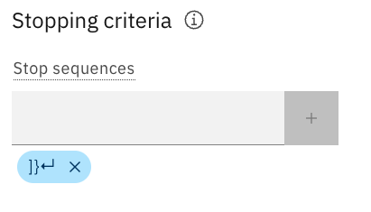

Next click on **Generate** and verify that you get the following mappings:

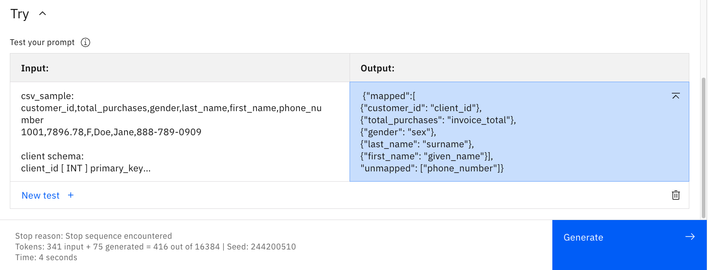
