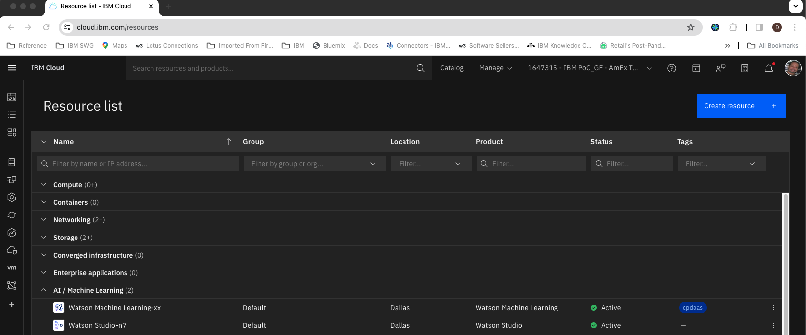
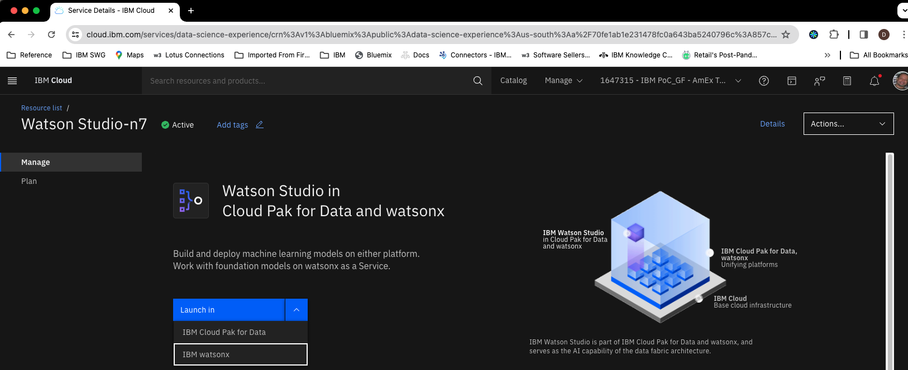
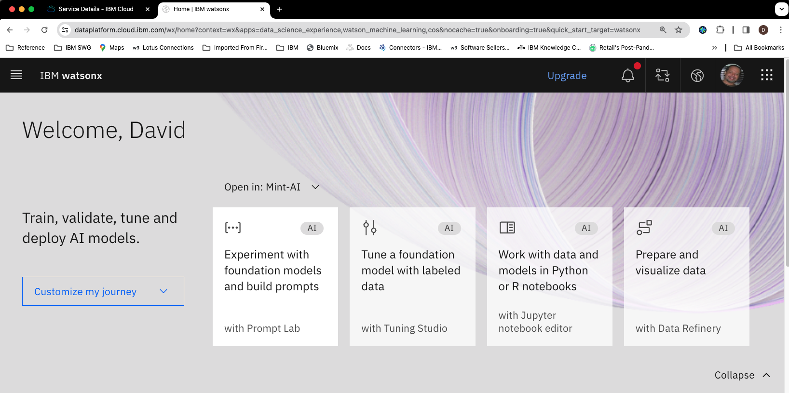
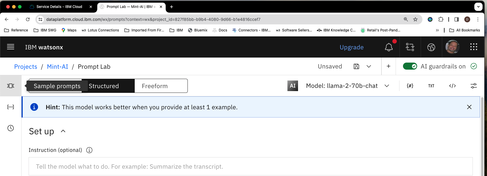
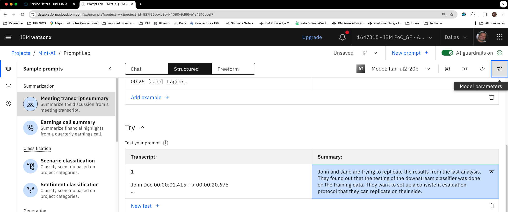

# Getting started with prompt lab

## Pre-requisites

- You need an [IBM Cloud Account](https://cloud.ibm.com/). 
- Access to the [IBM watsonx.ai Lite version](../watsonx-getting-started.md)

## Part 1. Access IBM watsonx Prompt Lab

Go to  IBM Cloud Console list of resources https://cloud.ibm.com/resources

In the **AI/Machine Learning** category click on your Watson Studio service

 
From the  **Launch in** drop down select **IBM watsonx**

Close the dialog that asks you to take a tour.

Click on the tile called **Experiment with foundation models and build prompts**

> [!NOTE]  
> If you're prompted to create a Project follow the prompts to do so now.

## Part 2. Exploring IBM watsonx Prompt Lab 

Click on the icon on the left to see the sample prompts.

 In the *Summarization* category select **Meeting transcript summary**
 
Note that the following has happened:

- The *flan-ul2-20b* model was chosen for you. The Prompt Lab Ui will pick the most appropraite model based on teh sample you choose.
- This example is using a *few shot learning* approach. There are 2 examples given of transcript summaries followed by the a longer transcript that you will summarize.
  
Click on the **Generate** button to get the summary. Compare it to the actual tracsript to the left to get an idea of how well the LLM performed the task.

Next take a look at the **Model parameters** by clicking on the icon on the right.

Note that the *Decoding* is set to **Greedy** by default which means that the LLM will always pick the next token with the highest probability as it is generating output. Change the *Decoding* to **Sampling** instead. This exposes 4 new parameters:

- **Temperature** - High values of temperature squeeze the probabilities of the next candidate tokens close together  allowing the LLM to  choose different options at each point. Low values do the opposite - they make the  LLM less likely to choose from  different options  for the  next token.

- **Top P (nuclues sampling)** - Only the smallest set of tokens with cumulative probabilities above this value will be considered.

- **Top K** - Controls the number of token  options considered when in Sampling mode. The higher the Top K value the  more yokens will be considered

- **Random Seed** - Controls the random sampling of the generated tokens when sampling is enabled. Setting the value to the same number during generation ensures some repeatability. 

Try 2 or 3 more samples noting which model is chosen for the various tasks and experiment with the *Sampling* variables by using the same prompt multiple times. High values of Top P, Top K and Temperature will give you the  most creativity and thus different responses to the same prompt  whereas low values will result in the  same response when the same prompt is submitted.

